# Kube-CC
基于K8S的轻量化大数据课程实验教学平台构建

前端地址：[https://github.com/fanb129/Kube-CC_vue](https://github.com/fanb129/Kube-CC_vue)

后端地址：[https://github.com/fanb129/Kube-CC](https://github.com/fanb129/Kube-CC)


## 一、环境

1. 后端Go1.18，Gin，client-go， gorm，zap，jwt-go
2. 前端vue2 + element，基于vue-admin-template模板
3. kubernetes1.17
4. MySQL8

## 二、后端配置文件

/conf/conf.ini

```ini
[server]
AppMode = debug
Port = :8080
PageSize = 10
ProjectName = fanb.com

[kubernetes]
KubeConfig = E:\go\Kube-CC\conf\kube.config
SparkImage = registry.cn-shanghai.aliyuncs.com/fanb/myspark:1.5.2_v1
CentosImage = registry.cn-shanghai.aliyuncs.com/fanb/mycentos:7
UbuntuImage = registry.cn-shanghai.aliyuncs.com/fanb/myubuntu:18.04
;HadoopImage = registry.cn-shanghai.aliyuncs.com/fanb/myhadoop:latest
HadoopImage = kubeguide/hadoop:latest

[database]
DbType = mysql
#DbHost = 127.0.0.1
DbHost = ******
DbPort = 3306
DbUser = root
DbPassWord = ******
DbName = k8s_deploy_gin
RedisHost = ***
RedisPort = 6379
[jwt]
JwtKey = kubernetes.com
TokenExpiredTime = 604800

[password]
bcryptCost = 10
SshPwd = root123456

[master]
Host = 192.168.139.131
Port = 22
User = root
Password = 1234567890
```

## 三、项目介绍

### 1. 平台功能结构图

 
 

### 2. 系统整体架构图

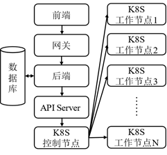 
 

### 3. 后端结构图

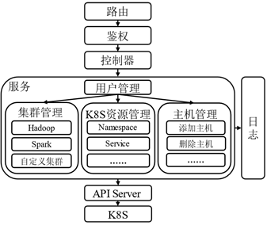 
 

### 4. 前端结构图

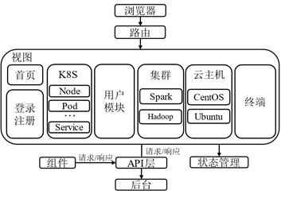 
 


## 四、项目展示

### 1. 首页

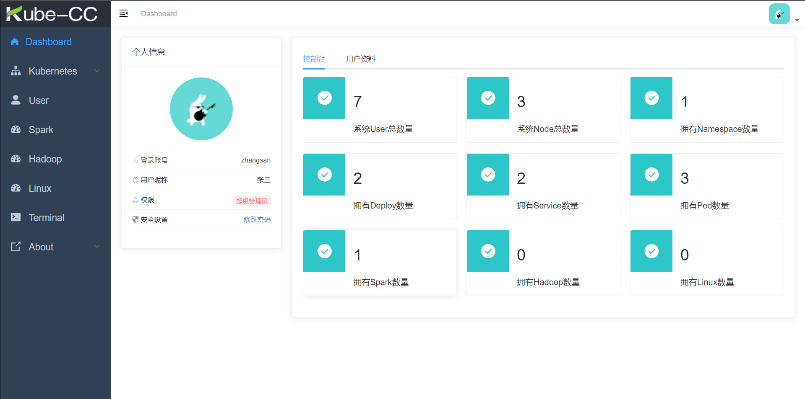


### 2. 用户管理

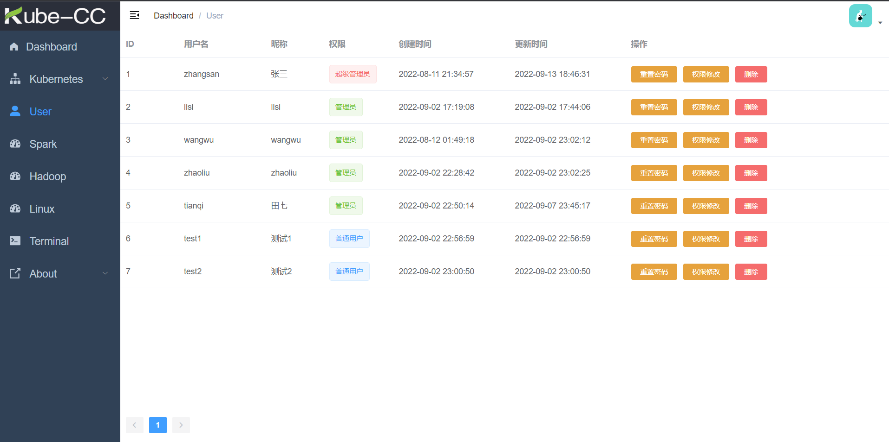


### 3. node

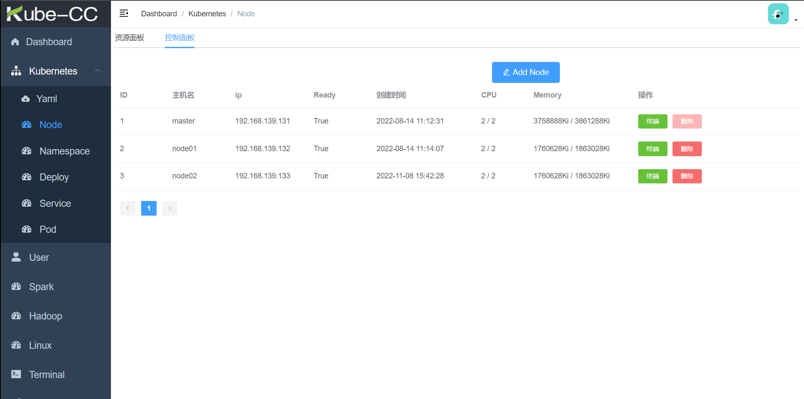


### 4. namespace

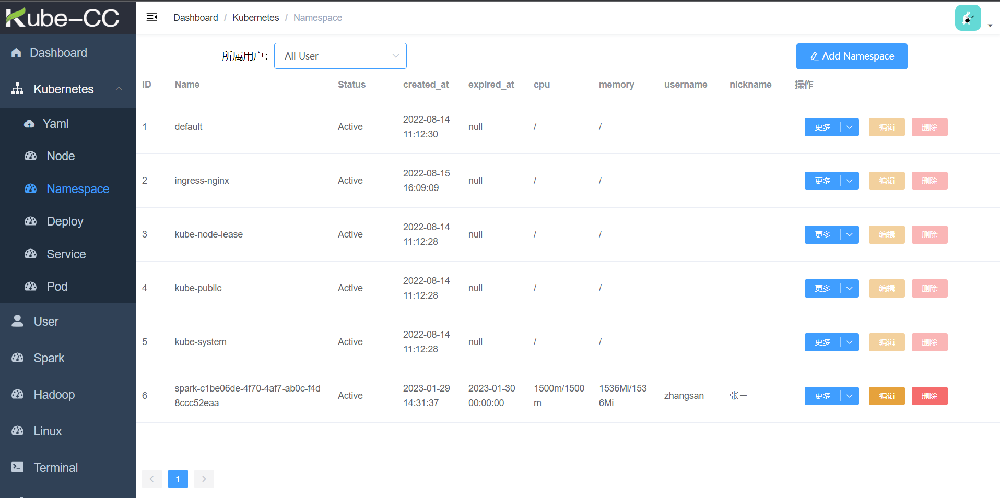


### 5. deployment

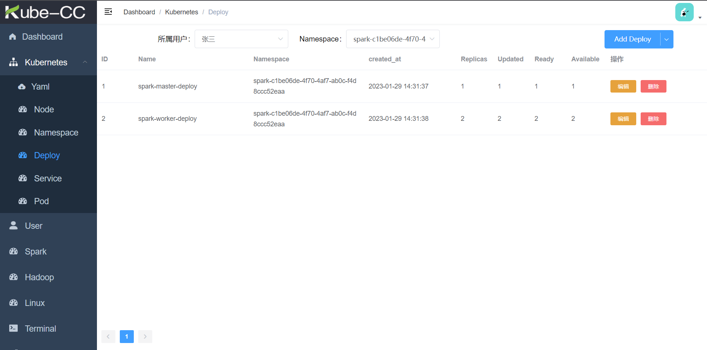


添加


编辑


### 6. service

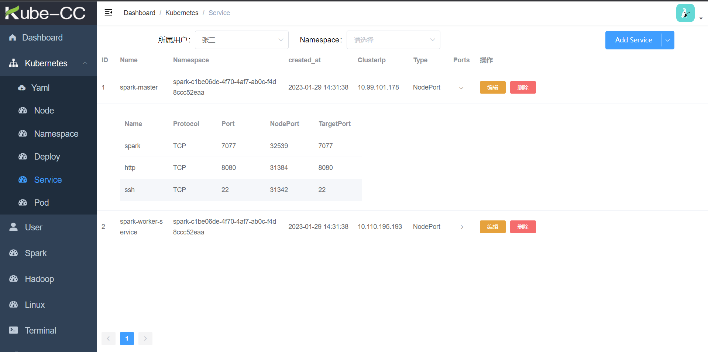


### 7. pod

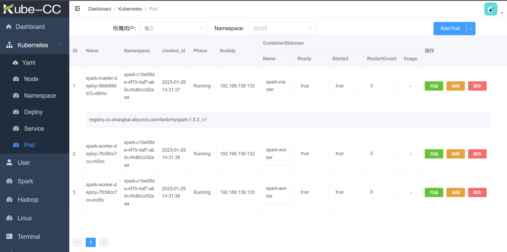


### 8. spark

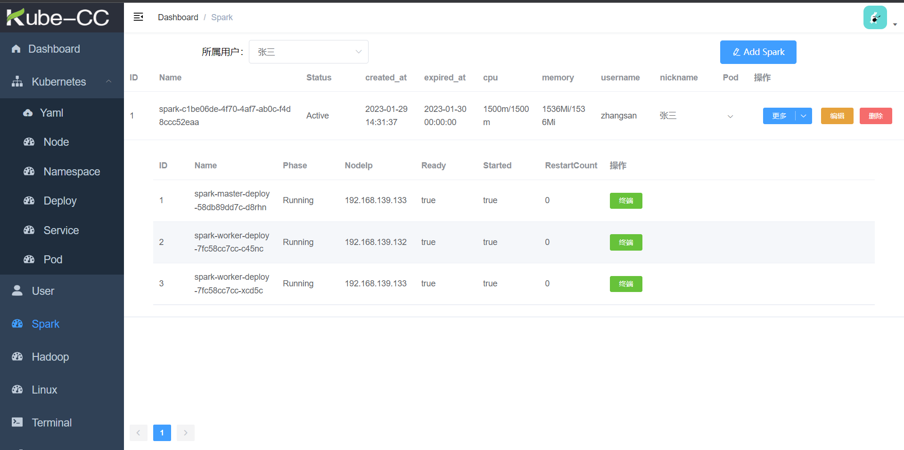


进入终端

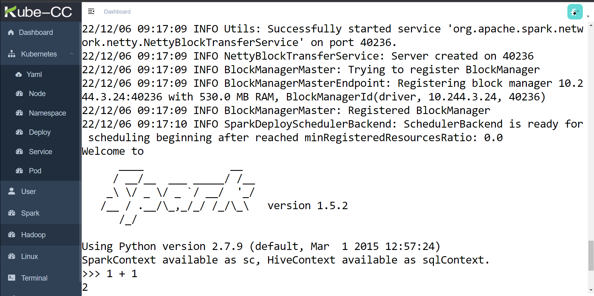


添加

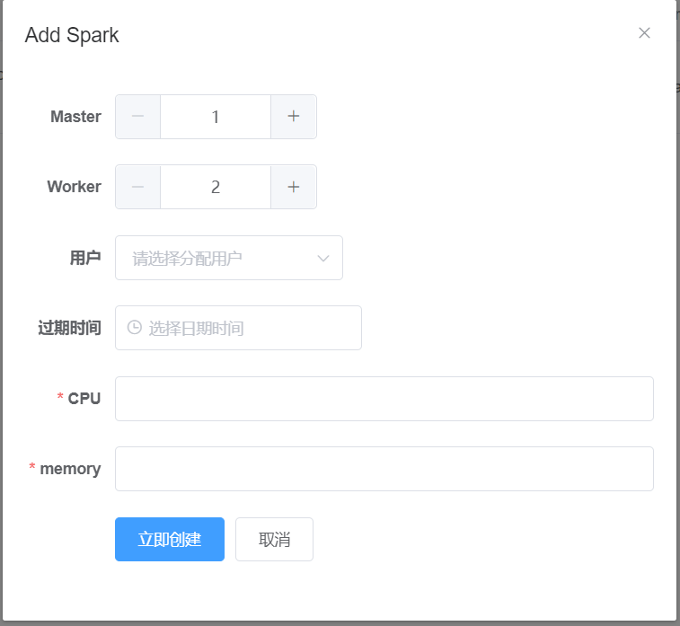 
 

### 9. terminal

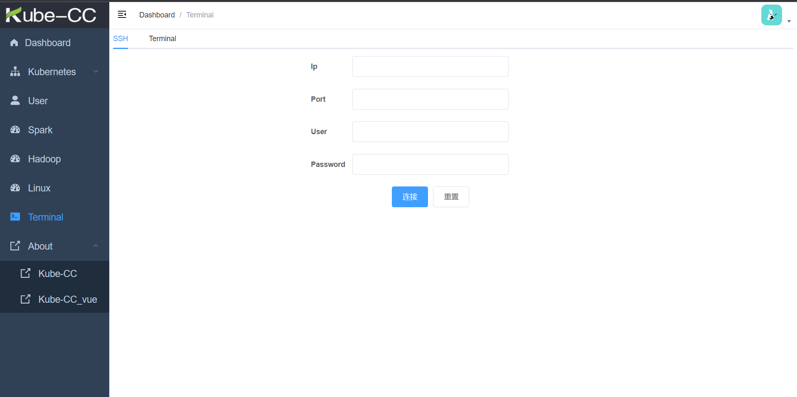

